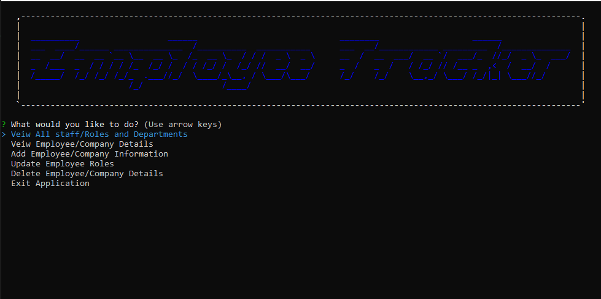

# employee-tracker

  ## Description
  * This repository is where I developed the Employee Tracker. Not only do I work on code and issues here. I also publish the latest updates and functions. This source code is avaialable to everyone under the Free Software Foundation, Inc. http//fsf.org/.
  
  

  ## Table of Contents
  * [Installation](#installation)
  * [Usage](#Usage)
  * [License](#License)
  * [Contributing](#Contributing)
  * [Questions](#Questions)
  

  ## Installation
  To install necessary dependencies, run the following command:
  
    npm install

  ## Usage
  To use the Employee Tracker, download all the files in the repository, open you terminal window and run the the program with th cmd node employeeTracker.js, this will run intiate the program and start asking questions. You will be able to add, view and delete employees, employees role and departments.

  ## License
  * MIT

  ## Contributing
  This repo was contributed by Tarmity Flassman

  ## Questions
  * If you have any questions, feel free to contact me via email: tarmity.flassman@gmail.com
  * My GitHub profile: https://github.com/tarmity

  ## Demonstration 
  * Watch the video for an example of how the app works: https://
  * You can also download the video from the assets folder

